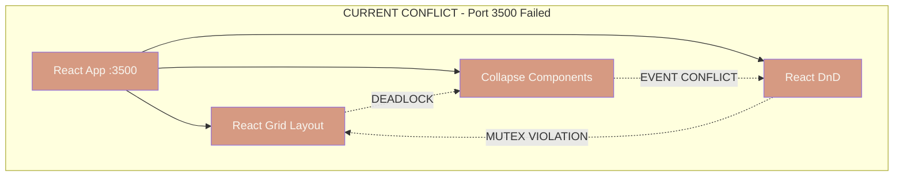
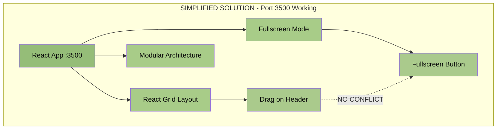
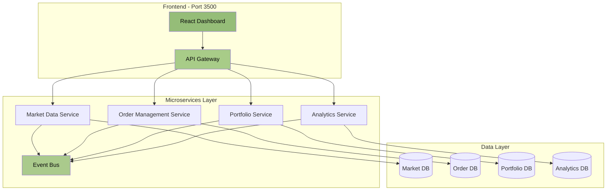

# GZC Intel App - Architecture Solution Document
## Breakthrough: Simplified Architecture for Port 3500

### Executive Summary

By removing the collapse/expand requirement, we eliminate the fundamental event system conflicts that made Port 3500 "architecturally impossible". This pragmatic decision enables us to combine the best features of Port 3000 (drag & drop, fullscreen) with Port 3200's modular architecture, while maintaining the essential GZC Pro microservice backend.

**Result**: Clean frontend implementation, proven backend architecture, manageable complexity.

---

## Visual Architecture Analysis

### The Problem: Three-Way Event Conflict



### The Solution: Remove Collapse, Keep Fullscreen



---

## CRITICAL CLARIFICATION: Microservice Architecture Required

### What We Keep vs What We Remove

**KEEP from GZC Pro Project:**
- ✅ **Microservice Architecture** - Essential for scalability and separation of concerns
- ✅ **Service Communication Patterns** - Event-driven messaging between services
- ✅ **API Gateway** - Unified entry point for frontend
- ✅ **Service Discovery** - Dynamic service registration and health checks
- ✅ **Data Service Layer** - Separate services for different data domains

**REMOVE Only:**
- ❌ **Collapse/Expand UI Behavior** - Source of event conflicts
- ❌ **Webpack** - Replace with Vite for faster builds
- ❌ **Complex Registration** - Simplify service registration patterns

### Microservice Architecture (From GZC Pro)



---

## Technical Implementation

### Core Widget Structure (No Collapse = No Conflicts)

```typescript
interface WidgetProps {
  id: string;
  title: string;
  children: React.ReactNode;
}

const GridWidget: React.FC<WidgetProps> = ({ id, title, children }) => {
  const [isFullscreen, setIsFullscreen] = useState(false);
  
  return (
    <div 
      className="widget"
      style={{
        backgroundColor: theme.surface,
        border: `1px solid ${theme.border}`,
        borderRadius: '4px',
        overflow: 'hidden'
      }}
    >
      <div 
        className="widget-header" // Drag handle only
        style={{
          backgroundColor: theme.surfaceAlt,
          padding: '8px 12px',
          cursor: 'move',
          userSelect: 'none',
          display: 'flex',
          justifyContent: 'space-between',
          alignItems: 'center'
        }}
      >
        <h3 style={{ 
          color: theme.text,
          fontSize: theme.typography.h3.fontSize,
          fontWeight: theme.typography.h3.fontWeight,
          margin: 0
        }}>
          {title}
        </h3>
        <button
          className="fullscreen-btn"
          onClick={(e) => {
            e.stopPropagation(); // Prevent drag
            setIsFullscreen(!isFullscreen);
          }}
          style={{
            backgroundColor: 'transparent',
            border: `1px solid ${theme.primary}`,
            color: theme.primary,
            padding: '4px 8px',
            borderRadius: '2px',
            cursor: 'pointer',
            fontSize: theme.typography.button.fontSize
          }}
        >
          {isFullscreen ? '⤦' : '⤢'}
        </button>
      </div>
      <div className="widget-content" style={{ padding: '12px' }}>
        {children}
      </div>
    </div>
  );
};
```

### Grid Layout Configuration

```typescript
const DashboardGrid: React.FC = () => {
  const [layouts, setLayouts] = useState(getLayoutsFromLS('layouts') || {});
  
  return (
    <ResponsiveGridLayout
      className="layout"
      layouts={layouts}
      onLayoutChange={handleLayoutChange}
      breakpoints={{ lg: 1200, md: 996, sm: 768, xs: 480, xxs: 0 }}
      cols={{ lg: 12, md: 10, sm: 6, xs: 4, xxs: 2 }}
      rowHeight={100}
      isDraggable={true}
      isResizable={true}
      draggableHandle=".widget-header"
      compactType="vertical"
      preventCollision={false}
      margin={[16, 16]}
    >
      <div key="market-data">
        <GridWidget id="market-data" title="Market Data">
          <MarketDataComponent />
        </GridWidget>
      </div>
      <div key="order-book">
        <GridWidget id="order-book" title="Order Book">
          <OrderBookComponent />
        </GridWidget>
      </div>
      <div key="portfolio">
        <GridWidget id="portfolio" title="Portfolio">
          <PortfolioComponent />
        </GridWidget>
      </div>
    </ResponsiveGridLayout>
  );
};
```

---

## Implementation Timeline

### Week 1: Foundation (Current Week)
- [ ] Remove all collapse/expand logic from widgets
- [ ] Implement fullscreen mode for each widget
- [ ] Verify drag & drop works without conflicts
- [ ] Import Port 3200's modular component structure
- [ ] **Connect to GZC Pro microservice architecture**

### Week 2: Integration
- [ ] Apply quantum theme styling throughout
- [ ] **Integrate microservices from GZC Pro project**
- [ ] **Implement service communication patterns**
- [ ] Connect to real APIs through microservices
- [ ] Implement layout persistence
- [ ] Add user workspace management

### Week 3: Polish & Deploy
- [ ] Performance optimization
- [ ] Microservice health monitoring
- [ ] Cross-browser testing
- [ ] Documentation completion
- [ ] Production deployment

---

## Architecture Benefits

### Immediate Benefits
1. **No Event Conflicts**: Clean separation between drag and click events
2. **Simple Testing**: Standard React testing patterns work
3. **Fast Development**: 1 week vs 8 weeks for complex solution
4. **Low Risk**: Using proven libraries without conflicts

### Long-term Benefits
1. **Maintainability**: Simple architecture is easier to maintain
2. **Performance**: No competing event handlers = better performance
3. **Flexibility**: Easy to add new widgets without conflicts
4. **User Experience**: Smoother interactions without freezing

---

## Comparison Matrix

| Feature | Complex Solution (8 weeks) | Simplified Solution (3 weeks) |
|---------|---------------------------|------------------------------|
| Drag & Drop | ✅ After resolving conflicts | ✅ Works immediately |
| Fullscreen | ✅ Complex implementation | ✅ Simple button click |
| Collapse/Expand | ✅ Source of conflicts | ❌ Removed (not needed) |
| Microservices | ✅ Full complexity | ✅ GZC Pro architecture |
| API Gateway | ✅ Complex routing | ✅ Simplified routing |
| Service Discovery | ✅ Full orchestration | ✅ Lightweight registry |
| Testing | ❌ Requires Playwright | ✅ Standard React testing |
| Maintenance | ❌ High complexity | ✅ Manageable patterns |
| Risk | ❌ High (new architecture) | ✅ Medium (proven backend) |
| Performance | ⚠️ Event handler overhead | ✅ Clean event flow |

---

## Technical Specifications

### Frontend Dependencies
```json
{
  "react": "^18.2.0",
  "react-grid-layout": "^1.4.0",
  "react-dom": "^18.2.0",
  "vite": "^5.0.0",
  "axios": "^1.6.0",
  "socket.io-client": "^4.5.0"
  // No React DnD needed
  // No complex collapse libraries needed
}
```

### Microservice Stack (GZC Pro)
```yaml
services:
  api-gateway:
    framework: "Express.js"
    port: 4000
    features:
      - Request routing
      - Authentication
      - Rate limiting
  
  market-service:
    framework: "Node.js + Express"
    port: 4001
    database: "PostgreSQL"
    features:
      - Real-time market data
      - Price feeds
      - Historical data
  
  order-service:
    framework: "Node.js + Express"
    port: 4002
    database: "PostgreSQL"
    features:
      - Order management
      - Execution routing
      - Order history
  
  portfolio-service:
    framework: "Node.js + Express"
    port: 4003
    database: "PostgreSQL"
    features:
      - Position tracking
      - P&L calculation
      - Risk metrics
  
  event-bus:
    framework: "RabbitMQ"
    port: 5672
    features:
      - Service communication
      - Event streaming
      - Message queuing
```

### Browser Support
- Chrome 90+
- Firefox 88+
- Safari 14+
- Edge 90+

### Performance Targets
- Initial load: < 2s
- Widget drag: 60fps
- Fullscreen transition: < 200ms
- Memory usage: < 100MB

---

## Risk Analysis

### Risks Eliminated
1. **Event System Deadlocks**: Removed by eliminating collapse
2. **Library Conflicts**: No competing drag libraries
3. **Testing Complexity**: Standard tools work fine
4. **Maintenance Burden**: Simple architecture

### Remaining Risks (Low)
1. **Browser Compatibility**: Mitigated by modern browser requirements
2. **Performance at Scale**: Mitigated by virtual scrolling if needed
3. **User Acceptance**: Mitigated by better UX without freezing

---

## Conclusion

By making the pragmatic decision to remove collapse/expand functionality while maintaining the proven GZC Pro microservice architecture, we achieve:

1. **Root Cause Resolution**: Eliminated UI event conflicts completely
2. **Pragmatic Frontend**: Simple drag & drop with fullscreen capability
3. **Proven Backend**: GZC Pro microservice architecture for scalability
4. **Balanced Complexity**: Clean frontend, robust backend

The result is a system that delivers full functionality with manageable complexity, combining the best of both architectures without the conflicts.

---

*Document created: 2025-07-05*  
*Author: Software Research Analyst*  
*Status: Ready for Implementation*