# Production Workflow - From Template to Component

## Overview

A structured workflow for developing new features as standalone apps first, then transforming them into integrated components using AI automation.

## Workflow Steps

```mermaid
graph LR
    subgraph "1. Development Phase"
        A[Frontend Template] --> B[Standalone App]
        B --> C[Style & Features]
        C --> D[Backend Services]
        
        style A fill:#95BD78,color:#0a0a0a
        style B fill:#95BD78,color:#0a0a0a
        style C fill:#95BD78,color:#0a0a0a
        style D fill:#95BD78,color:#0a0a0a
    end
    
    subgraph "2. AKS Deployment"
        D --> E[Container Build]
        E --> F[AKS Deployment]
        F --> G[Production Testing]
        
        style E fill:#A8CC88,color:#0a0a0a
        style F fill:#A8CC88,color:#0a0a0a
        style G fill:#A8CC88,color:#0a0a0a
    end
    
    subgraph "3. AI Transformation"
        G --> H[AI Job Triggered]
        H --> I[Component Generation]
        I --> J[Code Optimization]
        
        style H fill:#95BD7866,color:#0a0a0a
        style I fill:#95BD7866,color:#0a0a0a
        style J fill:#95BD7866,color:#0a0a0a
    end
    
    subgraph "4. Integration"
        J --> K[Engineer Review]
        K --> L[Component Integration]
        L --> M[Main App Update]
        
        style K fill:#D69A82,color:#f8f6f0
        style L fill:#A8CC88,color:#0a0a0a
        style M fill:#95BD78,color:#0a0a0a
    end
```



## 1. Frontend Template Structure

```
frontend-template/
├── src/
│   ├── components/
│   │   ├── Layout.tsx
│   │   └── Widget.tsx
│   ├── services/
│   │   └── api.ts
│   ├── theme/
│   │   └── quantum.ts
│   ├── App.tsx
│   └── main.tsx
├── Dockerfile
├── package.json
└── vite.config.ts
```

## 2. Standalone App Development

### Frontend Template Features
- Quantum theme pre-configured
- Component structure ready
- API service layer
- TypeScript setup
- Vite build system

### Backend Template
```yaml
# backend-template/docker-compose.yml
version: '3.8'

services:
  api:
    build: ./api
    ports:
      - "4000:4000"
    environment:
      - NODE_ENV=development
      - DATABASE_URL=postgresql://postgres:password@db:5432/app
    depends_on:
      - db
      - redis

  db:
    image: postgres:14
    environment:
      - POSTGRES_DB=app
      - POSTGRES_PASSWORD=password
    volumes:
      - db-data:/var/lib/postgresql/data

  redis:
    image: redis:7-alpine
    ports:
      - "6379:6379"

volumes:
  db-data:
```

## 3. AKS Deployment

### Deployment Manifest
```yaml
apiVersion: apps/v1
kind: Deployment
metadata:
  name: standalone-app
  namespace: development
spec:
  replicas: 2
  selector:
    matchLabels:
      app: standalone-app
  template:
    metadata:
      labels:
        app: standalone-app
    spec:
      containers:
      - name: frontend
        image: gcr.io/gzc-intel/standalone-app-frontend:latest
        ports:
        - containerPort: 80
        env:
        - name: REACT_APP_API_URL
          value: "http://api-service:4000"
      
      - name: backend
        image: gcr.io/gzc-intel/standalone-app-backend:latest
        ports:
        - containerPort: 4000
        env:
        - name: DATABASE_URL
          valueFrom:
            secretKeyRef:
              name: db-credentials
              key: connection-string
---
apiVersion: v1
kind: Service
metadata:
  name: standalone-app
spec:
  selector:
    app: standalone-app
  ports:
  - name: http
    port: 80
    targetPort: 80
  type: LoadBalancer
```

## 4. AI Transformation Job

### AI Job Configuration
```yaml
apiVersion: batch/v1
kind: Job
metadata:
  name: component-transformation
spec:
  template:
    spec:
      containers:
      - name: ai-transformer
        image: gcr.io/gzc-intel/ai-transformer:latest
        env:
        - name: SOURCE_REPO
          value: "https://github.com/gzc/standalone-app"
        - name: TARGET_COMPONENT
          value: "MarketAnalysis"
        - name: INTEGRATION_BRANCH
          value: "feature/market-analysis"
        command:
        - python
        - transform.py
        args:
        - --source=/app/source
        - --output=/app/components
        - --style=quantum
        - --optimize=true
      restartPolicy: OnFailure
```

### AI Transformation Process
```python
# transform.py
import ast
import os
from typing import Dict, List

class ComponentTransformer:
    def __init__(self, source_path: str, target_path: str):
        self.source_path = source_path
        self.target_path = target_path
        
    def analyze_standalone_app(self) -> Dict:
        """Analyze the standalone app structure"""
        return {
            'components': self.find_components(),
            'api_endpoints': self.find_api_calls(),
            'state_management': self.analyze_state(),
            'styling': self.extract_styles()
        }
    
    def generate_component(self, analysis: Dict) -> None:
        """Generate integrated component from analysis"""
        # Extract core functionality
        # Remove standalone bootstrapping
        # Convert to widget format
        # Integrate with main app patterns
        pass
    
    def optimize_for_integration(self) -> None:
        """Optimize component for main app integration"""
        # Remove duplicate dependencies
        # Merge styling with theme
        # Convert API calls to service layer
        # Add lazy loading support
        pass
```

## 5. Engineer Review Checklist

### Code Review
- [ ] Component follows project standards
- [ ] No duplicate functionality
- [ ] Proper error handling
- [ ] Performance optimized
- [ ] Security reviewed

### Integration Testing
- [ ] Component renders correctly
- [ ] API integration working
- [ ] State management compatible
- [ ] No style conflicts
- [ ] Accessibility standards met

### Deployment Validation
- [ ] Build process successful
- [ ] No bundle size regression
- [ ] Performance metrics acceptable
- [ ] E2E tests passing

## 6. Update Process

### For Updates to Existing Components
1. Make changes in standalone app
2. Test in AKS
3. Run AI transformation
4. Review diff
5. Merge to main app

### Benefits
- **Isolation**: Develop without affecting main app
- **Speed**: Rapid prototyping and testing
- **Quality**: Full testing before integration
- **Automation**: AI handles repetitive transformation
- **Safety**: Engineer review ensures quality

## Example: Market Analysis Widget

### 1. Standalone Development
```typescript
// standalone-app/src/App.tsx
export function App() {
  return (
    <div className="app">
      <MarketAnalysis />
    </div>
  );
}
```

### 2. After AI Transformation
```typescript
// main-app/src/components/widgets/MarketAnalysis.tsx
export const MarketAnalysisWidget: React.FC<WidgetProps> = ({ id }) => {
  const { data, loading } = useMarketData();
  
  return (
    <GridWidget id={id} title="Market Analysis">
      {/* Transformed component content */}
    </GridWidget>
  );
}

// main-app/src/components/registry.ts
export const widgetRegistry = {
  'market-analysis': lazy(() => import('./widgets/MarketAnalysis'))
};
```

## CI/CD Pipeline

```yaml
# .github/workflows/component-integration.yml
name: Component Integration

on:
  workflow_dispatch:
    inputs:
      source_app:
        description: 'Standalone app to transform'
        required: true
      component_name:
        description: 'Target component name'
        required: true

jobs:
  transform:
    runs-on: ubuntu-latest
    steps:
    - uses: actions/checkout@v3
    
    - name: Run AI Transformation
      run: |
        docker run gcr.io/gzc-intel/ai-transformer:latest \
          --source=${{ inputs.source_app }} \
          --component=${{ inputs.component_name }}
    
    - name: Create PR
      uses: peter-evans/create-pull-request@v5
      with:
        title: "feat: Add ${{ inputs.component_name }} component"
        branch: "component/${{ inputs.component_name }}"
        reviewers: engineering-team
```

This workflow ensures consistent quality while enabling rapid development and safe integration of new features.